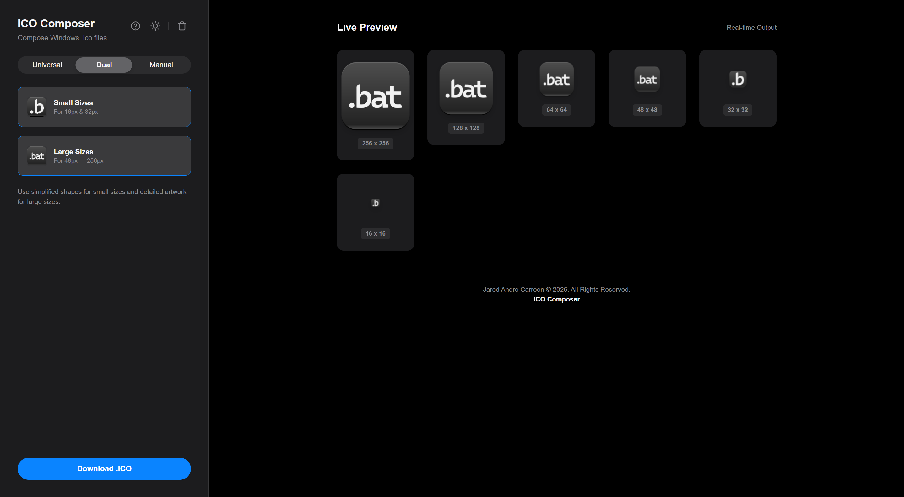

# IcoComposer

[](https://jaredandrelc.github.io/icocomposer/)

A lightweight, client-side tool for generating Windows Icon (`.ico`) files directly in the browser.

Unlike most *ad-littered* web converters that rely on server-side processing, IcoComposer constructs binary files entirely in JavaScript. It manually writes the ICO file header and directory structure byte-by-byte.


s
## ⚡ Key Features

* **Client-Side Binary Generation:** Uses `DataView` and `Uint8Array` to construct valid `.ico` binaries according to the official file specification.
* **Multi-Size Support:** Automatically resizes images to standard Windows sizes (16x16 up to 256x256).
* **AI Integration:** Optional integration with OpenAI (DALL-E 3) and Stability AI to generate icon assets on the fly.
* **Live Preview:** Real-time rendering of how the icon will look at various resolutions.

## 🔧 How It Works (The "Magic")

The core of this project is the `buildIcoBlob` function, which eliminates the need for external image processing libraries:

1. **Canvas Processing:** Input images are resized using the HTML5 Canvas API to generate raw pixel buffers.
2. **Binary Construction:** The app manually constructs the **ICO Header** (6 bytes) and **Icon Directory Entries** (16 bytes per image).
3. **Offset Calculation:** It dynamically calculates offset pointers for each image resource to ensure valid file structure.
4. **Blob Generation:** The final binary parts are merged into a single `Blob` for download.

## 💻 How to Run

1. Clone the repository:
    ```bash
    git clone [https://github.com/jaredandrelc/icocomposer.git](https://github.com/jaredandrelc/icocomposer.git)
    ```
2. Open `index.html` in your browser.

3. OR open the Github Pages [here](https://jaredandrelc.github.io/icocomposer/)

## 📚 Tech Stack

* **Language:** Vanilla JavaScript (ES6+)
* **APIs:** HTML5 Canvas, FileReader, DataView, Uint8Array
* **Style:** CSS Variables for easy Dark/Light mode switching

<br>

<br>

**Jared Andre Carreon © 2026. All Rights Reserved.**